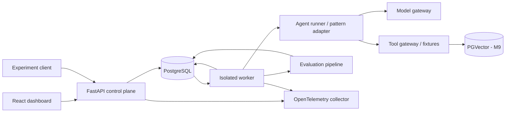

## Context

Proyecto nuevo, sin servicios ni datos previos. Véase `proposal.md` para motivación. Este documento fija decisiones de diseño, no declara funcionalidades implementadas. Los contratos de comportamiento están en las ocho capabilities de `specs/`; los formatos y fórmulas en los documentos adjuntos son parte del contrato propuesto.

## Goals / Non-Goals

**Goals:** comparar agentes, modelos y patrones con evidencia reproducible; separar rendimiento de tarea y de infraestructura; descubrir regresiones por escenario; ejecutar una baseline offline antes de usar un modelo real.

**Non-Goals:** chatbot general, entrenamiento/fine-tuning, agentes con acceso libre al host, leaderboard universal, todos los patrones desde el inicio, producción multi-tenant, acciones externas reales. Human-in-the-loop se diseña en un change futuro; no se sustituye por una aprobación simulada etiquetada como humana.

## Decisions

### 1. Evaluation philosophy

La unidad experimental es una ejecución de una configuración sobre una versión de escenario, con una repetición y seed definidos. Se evalúa el resultado y también el proceso observable. Una respuesta correcta por casualidad no borra una herramienta prohibida o evidencia inventada.

Orden: oráculo determinístico para respuestas verificables; validación estructural para formatos/llamadas; políticas para acciones y evidencia; judge únicamente para una dimensión subjetiva sin oráculo adecuado. No inferir razonamiento interno ni exigir chain-of-thought. Registrar acciones, observaciones, plan explícito y una explicación breve opcional.

`task_success` exige run completado, oráculo de tarea aprobado, estructura obligatoria aprobada y todos los gates de política aprobados. `raw_outcome_pass` se conserva por separado. Un error de evaluador deja resultado `unknown`, nunca aprobación. Los casos exclusivamente subjetivos reciben `judge_task_rating`, no task success determinístico. No se combinan dimensiones en una puntuación universal.

Cada score expone evidencia, versión de evaluador, aplicabilidad y causa. Distinguir `pass`, `fail`, `unknown`, `not_applicable`, `error`. Declarar hipótesis y gates antes de ejecutar. Los fallos, timeouts y violaciones se conservan; no seleccionar sólo el mejor intento. Los tests validan también los evaluadores con ejemplos positivos, negativos y mutaciones de resultados/trazas.

### 2. Domain model

Identificadores UUID para entidades; versiones publicadas inmutables identificadas también por SHA-256. Fechas UTC. Campos JSON versionados para payloads; relaciones e integridad en PostgreSQL.

| Entidad | Campos principales | Relaciones e invariantes |
|---|---|---|
| Experiment | id, hypothesis, status, manifest_hash, budgets, repetitions, seeds, comparison_plan | Una versión de Benchmark; una o más AgentConfigurations; 1:N Runs. Draft editable, snapshot al sellar |
| Dataset | id, name, version, schema_version, content_hash, split_manifest | 1:N versiones de Scenario; publicado inmutable |
| Scenario | id, version, primary_category, tags, input, fixtures, oracle_ref, limits | Pertenece al manifest del Dataset; contenido/oráculo separados; categoría primaria única |
| AgentConfiguration | id, version, pattern, prompt_hash, role_model_map, tool_refs, pattern_parameters | ModelConfiguration por rol; N:M ToolDefinition; snapshot completo |
| ModelConfiguration | id, version, provider, requested_model, resolved_revision, temperature, seed_support, max_tokens, price_snapshot_ref | Defaults resueltos antes del run; revisión desconocida declarada |
| ToolDefinition | id, version, name, input_schema, output_schema, effect_class, allowed_scope, timeout, fixture_hash | Validador y permisos fuera del LLM; definición independiente de adapter |
| Run | id, experiment_id, scenario_ref, agent_ref, repetition, seed, mode, status, started_at, ended_at, error_class | Único por tuple experimental; 1:N attempts operativos; 1:1 Trace lógica; 1:N Evaluations |
| Trace | id, run_id, schema_version, event_count, digest, completeness | 1:N eventos append-only; sellado terminal |
| Evaluation | id, run_id, trace_digest, evaluator_suite_hash, status, created_at | Nueva entidad en cada re-evaluación; 1:N Scores; no modifica Run |
| Score | evaluation_id, metric_id, metric_version, value, unit, status, numerator, denominator, evidence_refs | `value=null` si unknown/N/A/error; no convertir ausencias a cero |
| Benchmark | id, version, dataset_ref, scenario_selection, evaluator_suite, metric_profile, comparison_rules | Define protocolo sobre un Dataset; versión/hash independiente |

Auxiliares: Artifact (contenido direccionado por hash), RunAttempt (lease/fencing, retries de infraestructura), TraceEvent, ComparisonReport y PriceSnapshot. Dataset aporta casos; Benchmark fija cómo medirlos; Experiment fija qué variantes ejecutar; Run materializa una celda del diseño experimental.

Experiment: `draft -> sealed -> running -> completed | failed | cancelled`, más `sealed -> cancelled` para un experimento sellado que no llega a ejecutarse. `completed` significa todas las celdas terminales, no todos los agentes exitosos. Run: `queued -> running -> completed | failed | timed_out | budget_exceeded | cancelled`, más `queued -> cancelled` para celdas que no llegan a iniciarse al cancelar el experimento; worker perdido produce fallo de infraestructura explícito. Evaluation: `pending -> running -> completed | error`. Toda entidad nace en su estado inicial; cualquier otra transición, incluida la salida de un estado terminal, se rechaza. No reabrir resultados terminales; retries internos de tools son eventos, no nuevos éxitos ocultos.

`Run.mode` admite `live` (ejecuta el patrón contra gateways y fixtures reales del run, sin grabación previa; la baseline scripted es `live` sin llamadas a modelo y se distingue por `pattern=scripted`) y `replay`. La reevaluación no crea Run: es una Evaluation nueva con `parent_evaluation_id` y otro `evaluator_suite_hash` sobre la misma Trace.

Modelo físico (M1): las entidades versionadas (Dataset, Scenario, Benchmark, AgentConfiguration, ModelConfiguration, ToolDefinition) usan clave primaria `(id, version)` con `id` UUID lógico y `version` semver, de modo que las refs son claves foráneas compuestas. Dataset↔Scenario es N:M con posición explícita (el manifest fija el orden); AgentConfiguration↔ToolDefinition es N:M y el mapa rol→ModelConfiguration es una tabla con FK. Los estados se validan en el dominio y, de forma independiente, con triggers de PostgreSQL. Vocabularios cerrados no enumerados arriba: `ToolDefinition.effect_class ∈ {read_only, side_effect}`, `ModelConfiguration.seed_support ∈ {supported, unsupported, unknown}`, `Trace.completeness ∈ {complete, incomplete, invalid}` (NULL mientras la traza no está sellada) y `Score.scope ∈ {agent, judge, harness}`. AgentConfiguration añade `pattern_version` para identificar la versión del patrón. Las auxiliares se crean en el hito que define su comportamiento: RunAttempt (M2, 3.3), TraceEvent (M2, 3.1), Artifact (M4), PriceSnapshot (M6, 7.1) y ComparisonReport (M11); hasta entonces sus refs se guardan como valores validados, sin FK.

### 3. Architecture

FastAPI se propone por cohesión con tooling de evaluación en Python; NestJS es una alternativa válida, pero añadir otro runtime backend no aporta valor al primer laboratorio. React consume recursos de experimentos y trazas, no un flujo de chat. Monolito modular más worker separado; sin microservicios ni framework agéntico obligatorio inicialmente.

PostgreSQL es fuente de verdad: metadata relacional, eventos y snapshots JSONB. Artefactos pequeños en PostgreSQL al inicio; almacenamiento por objetos sólo si volumen lo justifica. Una cola de trabajos respaldada por PostgreSQL utiliza leases y fencing contra workers vencidos; registrar intento antes de efectos. API responde asincrónicamente al crear ejecuciones. El host del worker no es herramienta del agente. Red denegada salvo gateway de modelo explícitamente configurado; tools sintéticas con estado por run, sin credenciales reales.

OpenTelemetry captura spans API/worker/model/tool/evaluator y correlaciona `run_id`, `trace_id`, `span_id`. La traza de evaluación se persiste independientemente del sampling de telemetría. Una caída del collector no pierde evidencia; una caída de persistencia sí marca traza incompleta y prohíbe afirmar evaluación completa.

Sellado (M1): el manifest del experimento es JSON canónico RFC 8785 con hash SHA-256 e incluye hipótesis, benchmark y dataset (id, versión, hash), configuraciones de agente ordenadas por (id, versión) con roles→ModelConfiguration y tools resueltas, budgets, repeticiones, seeds en orden y plan de comparación. No incluye el id del experimento, de modo que configuraciones idénticas producen el mismo hash; los decimales se serializan como cadenas para no perder precisión. Commit, lockfile, imagen y runtime se sellan por run (manifest de `run.started`, M2/M4), porque el experimento se sella en la API y se ejecuta en workers. Sellar exige benchmark y al menos una configuración de agente. Tras sellar, PostgreSQL rechaza cambios en el experimento salvo su estado y en su lista de agentes; las versiones publicadas de entidades versionadas son de sólo inserción.

Idempotencia (M1): toda creación exige cabecera `Idempotency-Key` (400 si falta). La clave se registra por ámbito (método + ruta) con el hash canónico del cuerpo en la misma transacción que el efecto: igual clave e igual cuerpo devuelven la respuesta original con `Idempotent-Replayed: true`; igual clave y otro cuerpo devuelven 409 `idempotency_key_reused`. Una solicitud que falla no registra la clave y puede reintentarse. La celda duplicada con otra clave devuelve 409 `run_cell_exists` con el id existente. Crear runs responde 202: quedan `queued` hasta que el worker los tome (M2).

Superficie API propuesta: `/datasets`, `/datasets/{id}/versions/{version}`, `/scenarios/{id}/versions/{version}`, `/agent-configurations`, `/experiments`, `/experiments/{id}/runs`, `/runs/{id}`, `/runs/{id}/trace`, `/runs/{id}/evaluations`, `/comparisons`. Creaciones llevan idempotency key; rechazar la reutilización con payload diferente. Paginación estable de eventos por sequence; validación de referencias antes de encolar. Localhost por defecto; autenticación y autorización para cualquier demo remota. M12 usa datos sanitizados y vistas públicas de sólo lectura.

### 4. Agent interfaces

Contratos conceptuales, sin implementación ni dependencia de proveedor:

| Interfaz | Entrada | Salida / comportamiento |
|---|---|---|
| AgentRunner.execute | RunContext, AgentConfiguration snapshot, ScenarioPublicView, ModelGateway, ToolGateway, TraceSink | RunResult con output, status, evidence_refs, usage y error tipado; emite eventos durante ejecución |
| PatternAdapter | contexto, observaciones, configuración de roles, presupuesto restante | Acción model/tool/final o terminación; versión identificable |
| ModelGateway.generate | messages, tools permitidas, configuración resuelta, deadline | respuesta estructurada, tool calls, usage, provider request id, revisión; errores tipados |
| ToolGateway.invoke | tool/version, call_id, arguments, capabilities, deadline | validación, autorización, resultado/evidencia o error; no ejecuta si inválido |
| TraceSink.append | evento con secuencia y correlación | confirmación durable; reintento idempotente por event_id |
| Evaluator.evaluate | ScenarioOracleView privada, Trace sellada, RunResult, rubric snapshot | Evaluation con Scores y evidence_refs; sin acceso para modificar estado del agente |

RunContext fija IDs, modo, seed, reloj/deadline, límites de pasos/tokens/coste y sandbox. ScenarioPublicView sólo contiene tarea, schemas permitidos y documentos obtenidos legítimamente por tools. Oráculos, respuestas esperadas, perturbaciones ocultas y splits privados nunca entran en prompts ni recursos del runner. Usage distingue agent/judge y observado/estimado/desconocido.

Antes de cada llamada: validar presupuesto, deadline, permisos y schema. Errores: `invalid_arguments`, `denied`, `tool_timeout`, `transient_tool_error`, `model_error`, `infrastructure_error`, `trace_error`; conservar causa segura y retriable. Máximo de retries explícito por escenario; idempotency keys para tools con efectos y no reintentar un efecto de resultado ambiguo sin reconciliarlo. Coste es una estimación, no un tope de facturación exacto: reservar máximo estimado antes de llamar y registrar posible exceso por contabilización tardía. Si falta precio, rechazar un experimento que exige límite monetario; admitir otro sólo con límites de tokens/pasos y coste `unknown`.

Baseline inicial scripted: prueba el harness y oráculos, no demuestra inteligencia. ReAct M6 alterna decisiones/acciones/observaciones hasta respuesta o límite. Planner/Executor M7 añade plan explícito y roles separados, ambos dentro del mismo presupuesto global y trazado. No permitir que cambiar patrón cambie silenciosamente herramientas, escenario o límites. Router, Reflection, Critic, Evaluator-Optimizer, Supervisor y HITL quedan para changes posteriores con comparación contra las dos primeras baselines.

### 5. Reproducibility strategy

Manifest sellado incluye commit y árbol dirty (rechazado para baseline oficial), dependencias/lockfile, digest de imagen, SO/runtime, dataset/escenario/oráculos, prompts, tool fixtures, suite de evaluadores, métricas, budgets, seeds/repeticiones, modelos por rol, precios/moneda/fecha, timeout/retry, concurrencia, caché, corpus/chunking/embedding/retriever si aplica. Canonicalizar JSON (RFC 8785), UTF-8, hashes SHA-256; arrays preservan orden y el manifest explicita orden de escenarios.

Tres modos separados: `live` llama modelos; `replay` reproduce respuestas/tools grabadas verificando request digest y nunca llama proveedores; `reevaluation` aplica otra suite a una traza original sin ejecutar agente. Replay con divergencia termina `replay_mismatch`, no cae a live. Los tres tienen cohortes/reportes distintos; replay reproduce decisiones observadas, no prueba estabilidad del modelo remoto. Re-evaluación referencia evaluación padre y nuevo suite hash.

Fixtures, reloj sintético y estado de tools se reinician por run. Seed afecta sólo componentes que lo soportan. Temperatura cero y seed no garantizan igualdad remota; registrar revisión resuelta o desconocida, fecha y respuestas. Publicar reproducibilidad exacta offline y variabilidad empírica live como afirmaciones diferentes.

### 6. Benchmark, metrics and trace contracts

Véanse `benchmark-format.md`, `metrics.md` y `trace-format.md`. El contrato abarca oráculos determinísticos para las siete categorías, retrieval con corpus sintético y fallos inyectados controlados. Las métricas no aplicables se muestran como N/A con cobertura, nunca como 100% ni 0% por defecto. Se reportan presupuestos y consumo de todos los roles para que un patrón con más llamadas no parezca gratis.

### 7. LLM-as-a-judge risks

El judge no es ground truth. Riesgos: sesgo de posición/longitud/estilo; afinidad por su familia de modelos; errores factuales; sensibilidad al prompt; drift de proveedor; prompt injection dentro de respuesta/documentos; fuga de respuestas de evaluación; desacuerdo humano; coste y latencia extra. Mismo modelo agente/judge se declara conflicto potencial, no independencia.

Uso sólo con `deterministic_unavailable_reason` por dimensión. Pin de prompt/rúbrica/modelo/parámetros; inputs como datos delimitados sin tools/red; schema estricto, abstención y evidencia obligatoria. Nunca sobreescribe gates determinísticos ni acredita cumplimiento de políticas. Comparaciones pareadas ciegan nombre del agente y alternan posición. Registrar cada voto y discrepancia; no convertir una confianza verbal del LLM en probabilidad calibrada.

M8 exige un set de calibración separado de al menos 30 respuestas sintéticas (correctas, incorrectas, ambiguas e inyecciones), dos anotadores humanos independientes y resolución documentada. Reportar acuerdo, matriz de confusión, cobertura/abstención y Cohen kappa cuando sea definido. Umbral propuesto de uso auxiliar: acuerdo >= 0.80 en ratings adjudicados y ningún caso de inyección de la suite que altere instrucciones del judge; si no pasa, resultados `experimental` y sin gate de release. No es garantía general ni tamaño suficiente para certificar seguridad. Nunca entrenar/tunar contra held-out sin publicar nueva versión y declarar contaminación.

### 8. Optional eval-mcp-server

API directa es la opción por defecto: menos superficie y mismos contratos para dashboard/CI. MCP aporta valor sólo si clientes agénticos externos necesitan descubrir e invocar la evaluación mediante protocolo común; se decidirá con un cliente real y un change propio después de M11.

Tools candidatas: `get_dataset` (manifest público), `get_scenario` (vista pública), `submit_run` (payload validado, idempotente, procedencia externa), `get_trace` (redactada), `get_evaluation`, `compare_experiments`. Todos reutilizan servicios y autorización de la API. Runs externos son no confiables, no ejecutan código enviado y no participan en baseline oficial salvo reconstrucción/verificación por el harness. MCP no debe exponer oráculos privados ni convertir un tool en autoridad de aprobación.

### 9. Toolchain and pinned versions (M0)

Decisiones de entorno tomadas en M0 (2026-09-29). No cambian comportamiento de las capabilities; cambiar cualquiera exige actualizar esta sección y el lockfile correspondiente.

| Elemento | Decisión | Justificación |
|---|---|---|
| Python | CPython 3.14.7 (`backend/.python-version`, `requires-python ==3.14.7`) | Última estable; misma versión exacta en local (gestionada por uv), CI e imagen `python:3.14.7-slim-trixie` |
| Gestor Python | uv 0.12.20 (`required-version`), `uv.lock` con hashes, dependencias directas `==`, build backend `uv_build==0.12.20` | Un solo binario para intérprete, entorno y lock; `--locked` falla si el lock no corresponde |
| Backend | FastAPI 0.141.1, Uvicorn 0.54.0, pydantic-settings 2.15.0, psycopg[binary] 3.3.6 | Mínimo para control plane, worker y comprobación de PostgreSQL; sin ORM hasta M1 |
| Calidad Python | Ruff 0.16.9 (formato y lint), mypy 2.3.1 `strict`, pytest 9.1.1, httpx2 2.13.1 (TestClient de Starlette 1.x) | Formato/tipos exigidos por 1.2 con herramientas deterministas y sin red |
| Node | 22.23.1 (`.nvmrc`, `engines`, `engineStrict`) | Instalada localmente y LTS en mantenimiento hasta 2027-04-30; revisar paso a Node 24 LTS antes de M10 |
| Gestor frontend | pnpm 12.4.2 (`packageManager`), workspace raíz + `frontend/`, `saveExact`, `--frozen-lockfile` | Aislamiento estricto de dependencias y un único `pnpm-lock.yaml` que también fija la CLI de OpenSpec |
| Frontend | React 19.3.0, Vite 8.3.1, @vitejs/plugin-react 6.1.1, TypeScript 7.0.2 (`tsc --noEmit` estricto), Prettier 3.9.9 | Versiones estables actuales; sin librería de estado/routing hasta que existan vistas (M10) |
| OpenSpec | CLI 1.11.0 como devDependency raíz, telemetría desactivada (`OPENSPEC_TELEMETRY=0`) | Misma versión con la que se validó el change; actualizar (1.13.x disponible) es decisión aparte |
| Migraciones | Alembic 1.20.0 + SQLAlchemy 2.1.1 sobre psycopg 3 (M1); `evallab-migrate` y servicio Compose `migrate` antes de API/worker | Revisiones versionadas en Python, DDL transaccional en PostgreSQL, sin otro runtime; test de deriva modelo↔migración |
| PostgreSQL | `postgres:18.6-trixie` fijada por digest | Última mayor publicada (19 no existe aún); M9 debe usar una imagen PGVector de la misma mayor |
| Contenedores | Imágenes base e imagen de uv fijadas por tag y digest; uid 10001, FS de sólo lectura, `cap_drop: ALL`, `no-new-privileges` | Reproducibilidad del entorno y superficie mínima |
| CI | GitHub Actions con acciones fijadas por SHA, `permissions: contents: read`, sin secretos | Jobs `openspec`, `backend`, `frontend`, `compose-smoke`; mismos comandos que en local |
| OpenTelemetry | Diferido a M4 | M0 no instrumenta; evita dependencias sin uso |

Aislamiento preparado en M0, sin sandbox: el worker sólo se conecta a la red Compose `internal` (`internal: true`, sin salida a Internet), no publica puertos ni monta volúmenes del host o el socket de Docker. `SandboxPolicy` sólo admite `network=deny` y `host_tools=false`; otro valor aborta el arranque. Habilitar egress para el gateway de modelo (M6) requiere un delta de agent-execution y una ruta explícita a través del gateway, no red directa del agente.

API y worker exponen `/health` (liveness, sin dependencias) y `/health/ready` (consulta a PostgreSQL; sólo devuelve la clase de error). Son endpoints operativos, fuera de la superficie de dominio. El de worker escucha en `127.0.0.1` dentro de su contenedor.

## Risks / Trade-offs

- Dataset pequeño y sintético → publicar alcance y casos por categoría; no generalizar a producción.
- Sobreajuste y contaminación → separar dev/held-out, registrar acceso y nuevas versiones; demo pública no es held-out secreto.
- Evidencia ausente por redacción → mantener hashes/metadata segura; marcar checks no verificables como unknown.
- Seguridad del sandbox → fixtures sin efectos reales; pruebas de escape/denegación antes de demos externas.
- Precio/modelo mutable → snapshots y costes estimados; comparación condicionada a versión disponible.
- Diseño amplio → tareas por hito y specs delta antes de cambios de comportamiento; no construir todos los adaptadores ahora.

## Migration Plan

No hay datos existentes que migrar. M0 fija entorno y versiones; M1 agrega esquema versionado; fixtures offline habilitan M2–M5. Cada hito valida sus escenarios antes del siguiente. Migraciones futuras son aditivas; no reescribir snapshots históricos. Ante regresión se desactiva la nueva suite/adapter para nuevas ejecuciones y se selecciona la versión previa; preservar runs fallidos y reportes anteriores.

## Open Questions

- Proveedor/modelo live y presupuesto monetario concreto antes de M6; no cambian el contrato neutral.
- Proveedor de hosting y retención operativa antes de M12; toda purga deberá declarar evidencia no disponible y preservar metadata de procedencia permitida.

## References

El flujo y los artefactos se verificaron contra OpenSpec CLI local 1.11.0 y su documentación oficial: [CLI](https://openspec.dev/docs/cli), [spec-driven](https://openspec.dev/docs/schemas/spec-driven). Las elecciones de arquitectura, umbrales y protocolo estadístico son decisiones propuestas para este laboratorio, no resultados medidos ni requisitos de OpenSpec.
